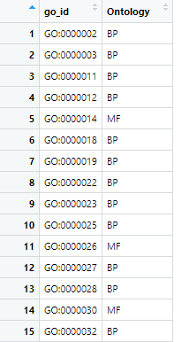
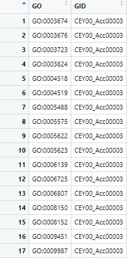
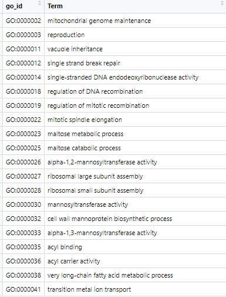

# clusterProfiler |给 enricher() 和 enrichGO() 写个弟弟——enricherGO()

## 介绍

`clusterProfiler ` 包中的两个富集函数`enricher()` 和 `enrichGO()` ，都可以做GO的差异富集，前者更加通用，后者功能更加完善。

前者的通用是它能用于非模式生物的GO与KEGG，后者完善是其结果能直接用于`clusterProfiler::simplify()` 。

Y叔并没有让`enricher()` GO富集结果能直接用于`clusterProfiler::simplify()` ，感兴趣的自己去试下。

我做的是非模式生物，但是我还想用`clusterProfiler::simplify()` ，所以我在`enricher()` 基础上给 `enricher()` 和 `enrichGO() `写个弟弟——`enricherGO()` 。其结果保留了R包`"DOSE"` 中定义的`"enrichResult"` 类。代码只是能运行，运行不一定就正确，慎用！慎用！

## 准备数据

准备输入数据`go2ont` , `go2gene`, `go2term`和 `DEG_DESeq2`

`go2ont` 可由`clusterProfiler::go2ont()` 获取。



`go2gene` 是你的注释结果，内容如下：

第二列为所有gene，这里巧合了，截图部分只有一个gene。




`go2term` 可由`clusterProfiler::go2term()` 获取。



`DEG_DESeq2` 是我的上下调基因结果，行名为差异基因ID，此处示例随机选取了我实际数据的60个基因展示（此处不做展示）。

## 使用

我写的`enricherGO()` 除`go2ont`与`ont` 参数外，均与`enricher()` 相同。

`ont` 与`enrichGO()` 相同。`"BP", "MF", "CC", "ALL"` 之一。如果你下面提供的`go2ont` 中只有一种`Ontology` ，如`BP`，即使你在函数中指定`ont = "ALL"` ，函数内部也会将`ont` 强制命名为`BP`。

函数内部运行不管你选哪种`ont`，其实都是先以`ALL`分析完，如果你的`ont`  为`"BP", "MF", "CC"` 则会进行再次筛选。

`go2ont` 可以由`go2ont()` 获取。这个参数也可以不指定，此时将利用`clusterProfiler`从网络获取数据。不过强烈建议提前准备好，不然每次运行函数都下载一次，不知道会不会封你IP呀。

这个参数我猜测应该有更高级的写法，比如可以第一次运行时获取，再次运行时则在现有变量中搜索这个变量名称。当然，这只是我瞎猜的，不确定是否有这种写法。mark一下，回头有机会再来尝试。

其实这里写的时候我有点犹豫，当指定的`go2ont` 与`ont` 可能冲突时可以有两种选择，我选择是以`go2ont` 为准，另一种方式是以`ont =ALL` 为准。反正函数就明明白白摆在这里，大家跟我选择相左可以自己修改。

```sh
library(BioUncle) #我自己的R包。# devtools::install_github("zhengshimao/BioUncle")
library(clusterProfiler)
library(dplyr)
library(tidyr)
go_results3 <- enricherGO(gene = rownames(DEG_DESeq2_ALL_DH_12h_vs_DH_0h),
                          go2ont = go2ont,
                          pvalueCutoff = 1,
                          ont = "ALL",
                          pAdjustMethod = "BH",
                          qvalueCutoff = 1,
                          TERM2GENE = go2gene,
                          TERM2NAME = go2term)
                          
class(go_results3)
## [1] "enrichResult"
## attr(,"package")
## [1] "DOSE" 
class(go_simplfy3)
## [1] "enrichResult"
## attr(,"package")
## [1] "DOSE" 

dim(go_results3@result)
## [1] 508  10
go_simplfy3 <- clusterProfiler::simplify(go_results3)
dim(go_simplfy3@result) 
## [1] 267  10
```

可以清楚看到结果中GO词条减少了。

```sh
go_results2 <- enricherGO(gene = rownames(DEG_DESeq2_ALL_DH_12h_vs_DH_0h),
                          go2ont = go2ont,
                          pvalueCutoff = 1,
                          ont = "MF",
                          pAdjustMethod = "BH",
                          qvalueCutoff = 1,
                          TERM2GENE = go2gene,
                          TERM2NAME = go2term)
                          
unique(go_results2@result$ONTOLOGY)
## [1] "MF"

go_simplfy2 <- clusterProfiler::simplify(go_results2)
unique(go_simplfy2@result$ONTOLOGY)
## [1] "MF"
```

## 函数

```sh
enricherGO <- function(gene,
                       go2ont = NULL,
                       pvalueCutoff,
                       qvalueCutoff = 0.2,
                       pAdjustMethod = "BH",
                       universe,
                       minGSSize = 10,
                       maxGSSize = 500,
                       TERM2GENE,
                       TERM2NAME = NA
                       ){
  # go2ont
  if(is.null(go2ont)){
    message("Downloading……\nGO2Ontology table.")
    go2ont = clusterProfiler:::get_GO2Ontology_table() # devtools::check()  warning!
  }else{
    go2ont =  as.data.frame(go2ont)
    names(go2ont) <- c("go_id","Ontology")
    message("GO2Ontology: Ready!")
  }

  # enricher
  go_result <-  clusterProfiler::enricher(
    gene = gene,
    pvalueCutoff = pvalueCutoff,
    pAdjustMethod = pAdjustMethod,
    qvalueCutoff = qvalueCutoff,
    minGSSize = minGSSize,
    maxGSSize = maxGSSize,
    TERM2GENE = TERM2GENE,
    TERM2NAME = TERM2NAME)
  go_result@ontology <- "GOALL"

  # change the order of colnames
  go_result@result <- go_result@result %>% dplyr::left_join(go2ont,by = c("ID" = "go_id")) %>% dplyr::select(10,1,2,9,3:8) %>% dplyr::arrange(pvalue) %>% tidyr::drop_na()
  # rename,mkae it same to the result of enrichGO function.
  colnames(go_result@result)[1] <- "ONTOLOGY"

  return(go_result)
}
```

## 小结

感谢Y叔，感谢Y叔写`simplify`函数时的手下留情，不过以后多照顾下我们非模式生物那就更好了。

代码只是能运行，运行不一定就正确，慎用！慎用！
