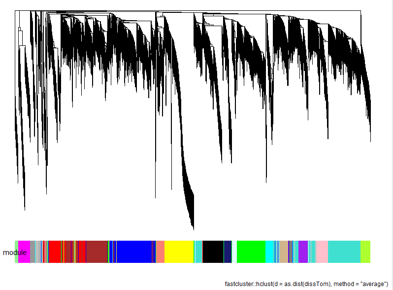
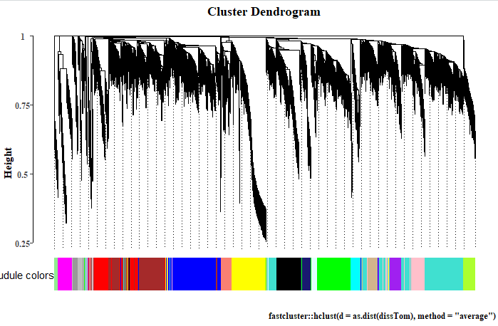
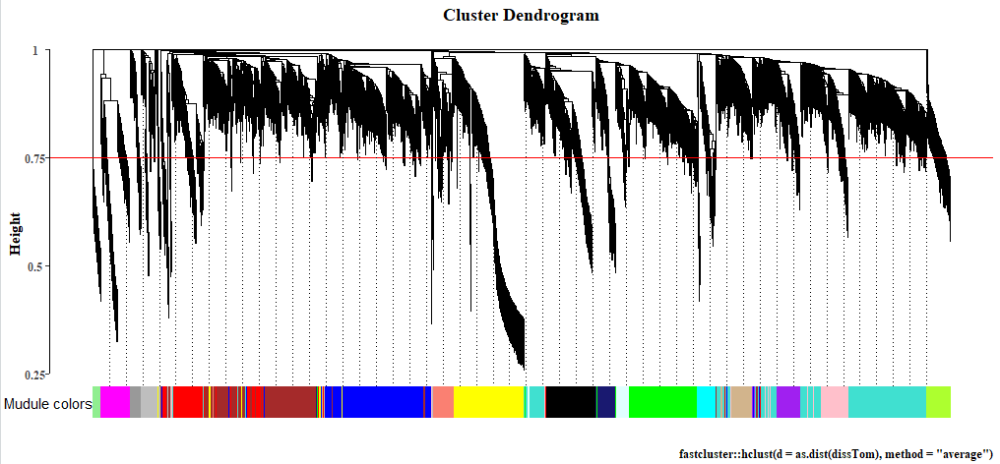

## 介绍

[《如何强行使用Y叔不让用的ggtreeDendro函数plot_wgcna》](https://mp.weixin.qq.com/s/77Q21VBA-rxbotupc-vSKA)介绍了强行使用Y叔`ggtreeDendro`包的`plot_wgcna` 函数重绘WGCNA中的`WGCNA::plotDendroAndColors()` 内容。今天修改plot_wgcna代码，使其出图更加贴近于WGCNA包的功能和结果。

本文代码保留了Y叔的`plot_wgcna` 函数的绝大部分内容。

代码为解决问题和分解式代码见[《使用ggtree重绘WGCNA::plotDendroAndColors()内容——修改Y叔的plot_wgcna函数》](https://mp.weixin.qq.com/s/ktbEz8XgAjXtm1uSJnEYGw)

## 代码思路

### 绘制基础聚类树p

- 文字设为了新罗马并加粗。没有写活。

### 添加abline

- 添加geom_vline(xintercept). 注意，不是geom_hline(yintercept).好像是与ggtree设为layout = "dendrogram"有关.

### 添加guide lines

- 该图不能给所有分支末端都添加guide lines，否则会极丑。没找到ggtree哪个函数能实现部分添加guide lines

- 通过检测，写if设置是否添加guide lines. 数值与NULL.
- 添加geom_segment(),设置线段的位置。在聚类是的第一个tip和最后一个tip必须有guide line（与之前推文不同）。
- 从基础ggtree图中获取分支末端tip坐标点，通过与统一的最低点的连线实现.
- 分支末端tip与guide lines允许一定的间隙,设置参数为line_interval
- 重中之重是构建数据框guide_lines进行映射。⭐

### 热图数据

- 重中之重是热图数据d构建：将行名设为p\$data\$label，显示热图的colnames，通过rename与all_of实现带空格的colnames。⭐
- 将热图数据设为"颜色"（即基因所属模块颜色），使用scale_fill_identity()实现颜色填充。⭐
- 通过group_labels_position实现热图colnames_position与hjust，并将起转换为常规视图效果。简单写了防御性检测。

## 其它思考

if条件句，如果后只接一句，是不是不写`{}`会更好些呢?这样是不是更容易让人阅读与识别if句段呢?

## Y叔的plot_wgcna

Y叔的plot_wgcna函数内容如下：

```sh
plot_wgcna <- function(x) { # x `WGCNA::blockwiseModules()` output
  colors <- x$colors
  labels2colors <- yulab.utils::get_fun_from_pkg(fun="labels2colors", pkg="WGCNA")
  if(is.numeric(colors)) {
    colors <- labels2colors(colors)
  }      

  d <- data.frame(module=as.character(colors),
                row.names=seq_along(colors))

  p <- ggtree(x$dendrograms[[1]], layout = "dendrogram", ladderize = FALSE, size=.2)

  gheatmap(p, d, color=NA, width = .1) + scale_fill_identity() + 
    labs(caption = as.character(as.expression(x$dendrograms[[1]]$call)))
   
}
```

绘图结果



## 代码

本文示例数据：从WGCNA官网教程准备`WGCNA::blockwiseModules()` 函数运行结果变量`net`，并用`save(net, file = "net.Rdata")` 保存。

### 环境与示例数据

```sh
rm(list = ls())
# devtools::install_github("zhengshimao/BioUncle")
library(BioUncle)

load("net.Rdata")
```

### 参数设置与说明

```R
# tree
x  # Output of WGCNA::blockwiseModules().

# abline
abline_height = NULL # Abline height. If it is NULL, abline would not be added.
abline_color <- "red" # The color of abline.

# guide lines # 类似于ggtree::geom_tiplab()中设置align = T
n_guide_lines <- 50 # Number of guide lines. If it is NULL, guide lines would not be added.
gudide_linetype <- "dotted" # Specifiy the type of line segment. Learn more about setting these aesthetics in vignette("ggplot2-specs").
line_interval <- 0 # The distance between tips and guide lines.
line_lowest_height <- "auto" # 	Specifiy the lowest height of all guide lines. "auto" or a numberic value.

# heatmap
offset_tree_heatmap  <- 0  # The distance between tree object and heatmap.
heamap_height <- "auto" # 	Heatmap height. "auto" or a numberic value.
group_labels = "Mudule colors" # Label for the heatmap.
group_labels_position = "left" # Position of group_labels. "left" or "right".
```

### 绘图

```R
wgcna_plot_DendroAndColors(x = net)
```



```sh
wgcna_plot_DendroAndColors(x = net, abline_height = 0.75)
```



