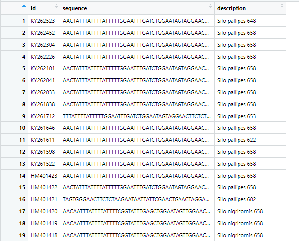
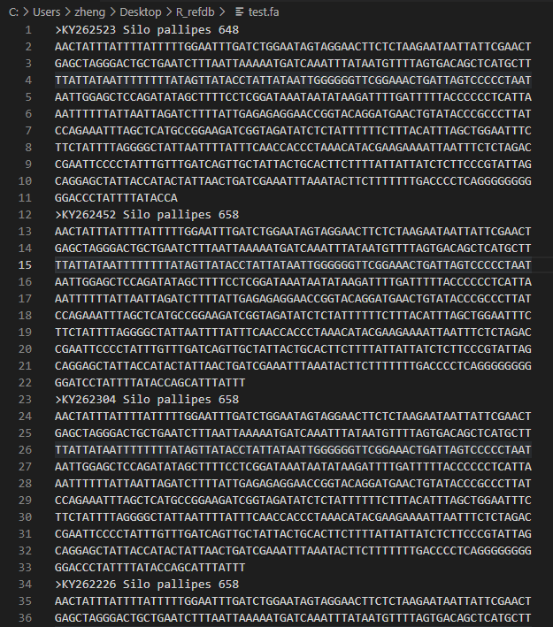

#  R函数 | 写个自己的write_fasta()导出fasta序列

## 介绍

昨天推文写到通过`refdb::refdb_import_NCBI()`  下载了序列，是一个数据框格式。如果我想把序列写出为`fasta`格式，那么该如何做呢？

这里自己写个`write_fasta()`  ，但是用类似`write_fasta()` 这个函数名在各大包中占用的太多了，我把名字改为了`write_bio_fasta()` 。

## 环境准备

其实下面都是通过`包名::函数` 方法调用的，写出来主要是让大家看下用了什么包。

```R
rm(list = ls())
library(refdb)
library(dplyr)
library(stringr)
library(tidyr)
library(readr)
library(magrittr)
```

## 准备数据

这里还是用昨天推文提到的`refdb::refdb_import_NCBI()` 

```R
# 1. 下载序列
silo_ncbi <- refdb::refdb_import_NCBI(query = "Silo COI", 
                               full = TRUE, 
                               max_seq_length = 10000, 
                               seq_bin = 200, 
                               verbose = TRUE 
)
```

## 处理序列数据

上面的`silo_ncbi` 对象是个数据框，我们从中提取`id,sequence,species,length`四列，作为要输出的fasta信息。前两列分别为必需的fasta id和fasta 序列，这里我们合并后两列，作为 fasta的描述部分。描述列为非必须部分。

注意：列的顺序不要改；列名可以随意。

```R
# 2. 准备序列数据框
# 准备要写出的序列，数据框格式，第一列为id，第二列为sequence，第三列为description
## 这里将species和length两列内容合并作为description部分。
simple_seq <- silo_ncbi %>% dplyr::select(id,sequence,species,length) %>% 
  tidyr::unite(col = "description",species,length,sep = " ",remove = TRUE, na.rm = FALSE)
  # unite 合并数据框的列
```
`simple_seq` 内容如下。



其实，也可以完全把第一列`id`和第三列`description` 合并到第一列。

## 参数说明

- `data` 一个数据框，含2列或者3列。具体格式详见`处理序列数据` 部分。
- ` file` 需要输出的 fasta文件。
- `width = 60` 输出结果fasta序列每行碱基数
- `append = FALSE` 和`num_threads = readr_threads()` 同`write_lines()` 的参数

##  函数定义

```R
# 3. 定义fasta序列写出函数：write_bio_fasta()
# simple_seq 三列的列名，不重要。
write_bio_fasta <- function(data, file, width = 60, append = FALSE,num_threads = readr_threads()){
  
  # check data 
  stopifnot(is.data.frame(data)) #必须为数据框格式。
  n_col <- ncol(data)
  if(n_col != 2 & n_col != 3){
    stop("`data`: the input must be a data frame with 2 or 3 columns!")
  }
  
  # prepare the list for `write_lines()`
  fa <- list() #提前定义下
  #width = 60 # 输出序列的的width
  for (i in seq(nrow(data))){
    
    n = length(fa) + 1 #向fa list 添加到第n个元素，也就是fasta序列文件的行数了。
    
    if(n_col == 2){
      id <- data[i,1] %>% stringr::str_replace(pattern = "^", ">") %>% as.character()
      fa[[n]] <- id
    } else {  #把esle if判断n_col = 3去掉了，也没写不等于2或3时如何。因为前面已经限定过了。
      id <- data[i,1] %>% stringr::str_replace(pattern = "^", ">") %>% as.character()
      description <- data[i,3] %>% as.character()
      fa[[n]] <- paste(id,description,sep = " ")
    }
    
    seq <- data[i,2] %>% as.character() #refdb的结果中seq列并不是简单的向量,转一下。
    
    for (x in seq(ceiling(stringr::str_length(seq)/width))) {
      fa[[n+1]] <- stringr::str_sub(seq,start = ((x-1)*width+1), end = x*width)
      n=length(fa)
    }
  }
  
  # 写出序列，设置append与num_threads
  readr::write_lines(fa,file = file, sep = "\n", append = FALSE, num_threads = readr_threads()) #要求为list或向量。若为list，写出的list内容，不含name
} 

```

## 执行

```R
write_bio_fasta(data = simple_seq, file = "test.fa",width = 70)
```

序列内容如下：



## 小结

有`write_bio_fasta()` 就该有`read_bio_fasta()` ，但是临近毕业，我在尽量克制自己做“与毕业无关的事”。暂时不写这个函数。其实`write_bio_fasta()`  也是个与毕业无关的函数，只是没控制好好奇心，还是写了下。

